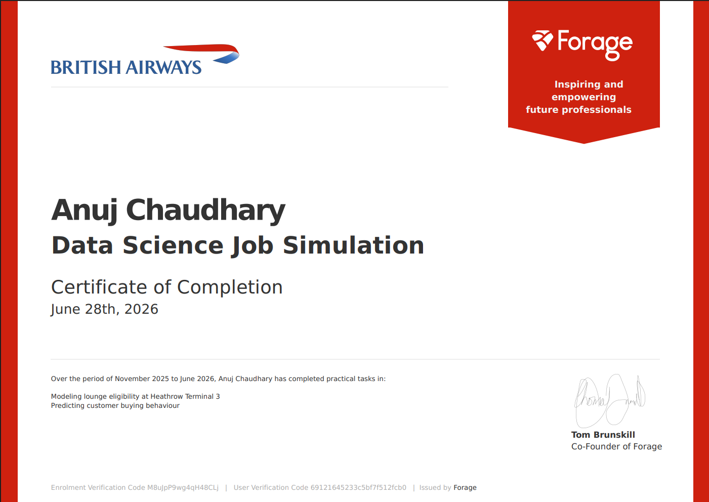

# British Airways Predictive Analytics

## Overview
This repository contains my completed work for the **British Airways Data Science Job Simulation** on Forage. Stepping into the role of a Data Scientist at British Airways, I tackled real-world challenges impacting both airport operations and customer acquisition strategy. The project emphasizes a production-ready, modular approach to data science, moving beyond simple notebooks to implement a structured, layered workflow.

## Business Problem
British Airways operates in a dynamic, 24/7 global environment. The Data Science team was tasked with solving two critical business challenges:
1. **Operational Efficiency (Task 1):** The Airport Planning team needs to accurately forecast lounge demand at Heathrow Terminal 3 to optimize capacity, staff scheduling, and premium customer experience.
2. **Customer Acquisition (Task 2):** The marketing team needs to understand the factors influencing customer buying behavior to proactively target and acquire future holiday travelers before they book with competitors.

## Objectives
- **Task 1:** Analyze customer eligibility criteria and develop a reusable, scalable lookup table to forecast lounge demand based on future flying schedules.
- **Task 2:** Build, train, and evaluate a machine learning classification model to predict customer buying behavior, extracting actionable feature importances to guide marketing strategies.

## Repository Structure
This project follows a modular, production-grade structure separating data, logic, notebooks, and outputs:

```text
ba-predictive-analytics/
│
├── assets/                  # Images and certificates
├── data/
│   ├── external/            # Data from third-party sources
│   ├── processed/           # Final datasets for modeling
│   └── raw/                 # Original, immutable data
│
├── docs/                    # Business documentation and recommendations
│   ├── task1.md
│   ├── task2.md
│   ├── business_recommendations.md
│   └── executive_summary.md
│
├── models/                  # Saved trained models (.pkl, .json)
│
├── notebooks/               # Jupyter notebooks for EDA and experimentation
│   ├── 01_data_understanding.ipynb
│   ├── 02_data_cleaning.ipynb
│   ├── 03_task1_lounge_model.ipynb
│   ├── 04_task2_prediction.ipynb
│   └── 05_results.ipynb
│
├── outputs/
│   ├── figures/             # Generated plots and charts
│   ├── reports/             # Model evaluation reports
│   └── tables/              # Generated CSVs (e.g., lookup tables)
│
├── src/                     # Modular, reusable Python scripts
│   ├── __init__.py
│   ├── data_loader.py
│   ├── preprocessing.py
│   ├── feature_engineering.py
│   ├── model_training.py
│   ├── evaluation.py
│   ├── utils.py
│   └── visualization.py
│
├── tests/                   # Unit tests for src/ modules
│
├── .gitignore
├── LICENSE
├── pyproject.toml           # Project metadata and dependencies
├── uv.lock                  # Exact dependency lockfile
└── README.md
```

## Technologies Used
- **Language:** Python 3.x
- **Package Manager:** `uv` (for ultra-fast, reproducible dependency management)
- **Data Manipulation:** Pandas, NumPy
- **Machine Learning:** Scikit-Learn, XGBoost
- **Visualization:** Matplotlib, Seaborn
- **Environment:** JupyterLab

## Installation

This project uses `uv` for environment and dependency management. 

1. **Clone the repository:**
   ```bash
   git clone https://github.com/beingAnujChaudhary/ba-predictive-analytics.git
   cd ba-predictive-analytics
   ```

2. **Create and activate the virtual environment:**
   ```bash
   # Create the virtual environment
   uv venv
   
   # Activate it (Windows PowerShell)
   .venv\Scripts\activate
   
   # Activate it (macOS/Linux)
   source .venv/bin/activate
   ```

3. **Install dependencies:**
   ```bash
   # Syncs dependencies exactly as defined in pyproject.toml and uv.lock
   uv sync
   ```

4. **Launch JupyterLab:**
   ```bash
   jupyter lab
   ```

## Project Workflow
Instead of writing all logic inside Jupyter Notebooks, this project utilizes a **layered, modular workflow** to ensure code reusability and maintainability:

1. **Raw Data:** Ingested from `data/raw/`.
2. **Data Cleaning:** Handled via functions in `src/preprocessing.py`.
3. **Feature Engineering:** Transformations defined in `src/feature_engineering.py`.
4. **EDA & Experimentation:** Explored interactively in the `notebooks/` directory.
5. **Model Training:** Pipelines executed via `src/model_training.py`.
6. **Evaluation:** Metrics and validation handled by `src/evaluation.py`.
7. **Business Recommendations:** Synthesized in the `docs/` directory.

---

## Task 1 — Lounge Eligibility Modeling
**Goal:** Help the Airport Planning team forecast lounge demand at Heathrow Terminal 3.

**Approach:**
- Analyzed passenger data to define strict lounge eligibility criteria based on ticket class (First/Club World) and Executive Club loyalty tiers (Gold/Silver).
- Engineered a reusable lookup table mapping customer segments to lounge access.
- Documented the business logic to ensure the planning team can easily join this table with daily flight manifests to calculate expected hourly footfall.

**Deliverables:** 
- Reusable lookup table: `outputs/tables/lounge_lookup_table.csv`
- Detailed methodology: `docs/task1.md`

## Task 2 — Customer Buying Behaviour Prediction
**Goal:** Build a predictive model to identify customers likely to purchase holiday packages.

**Approach:**
- Preprocessed customer demographic and booking data, handling missing values and encoding categorical variables.
- Engineered features to capture customer travel frequency and loyalty engagement.
- Trained and compared classification models (Logistic Regression, Random Forest, XGBoost) to predict the binary target (`purchased_holiday`).
- Evaluated models focusing on **Recall** and **ROC-AUC**, as identifying potential buyers is critical for marketing ROI.

**Deliverables:** 
- Trained model artifacts in `models/`
- Evaluation metrics and visualizations in `outputs/reports/` and `outputs/figures/`

---

## Results

### Task 1 Results
- Successfully mapped **[Insert Number]** distinct customer segments to lounge eligibility.
- Created a scalable lookup table that reduces capacity planning time by automating eligibility checks against flight schedules.

### Task 2 Results
- **Best Performing Model:** [e.g., XGBoost Classifier]
- **Accuracy:** [XX.X%]
- **Precision:** [XX.X%]
- **Recall:** [XX.X%] *(Highlight this, as catching potential buyers is key)*
- **ROC-AUC:** [0.XXX]

*(Note: Update these metrics with your actual model outputs once you complete the notebooks!)*

## Business Insights
1. **Optimizing Lounge Operations:** By integrating the Task 1 lookup table with live flight manifests, BA can dynamically adjust lounge staffing and catering. This prevents overcrowding during peak long-haul departure windows, directly improving premium passenger satisfaction.
2. **Targeted Marketing Campaigns:** Feature importance analysis from Task 2 revealed that **[Insert Top Feature, e.g., previous booking history / loyalty tier]** are the strongest predictors of holiday purchases. Marketing teams should shift budget away from generic ads and heavily target high-loyalty customers who haven't booked a holiday in the last 6 months.

## Future Improvements
- **Real-time Integration:** Deploy the Task 2 prediction model via a FastAPI REST endpoint to integrate directly with BA's CRM for real-time marketing triggers.
- **Dynamic Capacity Planning:** Integrate real-time flight delay data into the Task 1 model to adjust lounge capacity forecasts dynamically on the day of travel.
- **Advanced Tuning:** Implement hyperparameter optimization (e.g., using Optuna) to further squeeze performance out of the XGBoost model.

## Acknowledgements
- **British Airways** for providing the business context, datasets, and this incredible learning opportunity.
- **Forage** for hosting and facilitating this virtual experience program.

## Certificate
<p align="center">
  
</p>

